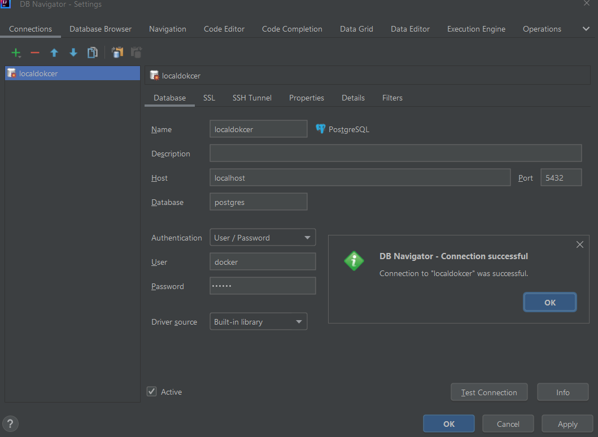

# MyPostgreSQL

My PostgreSQL

## Use PostgreSQL with Docker in Windows

### pgAdmin 4

<http://www.pgadmin.org>

### IntelliJ

Install "Database Navigator" plugin!

Note:

"Database tools" plugin is not free - uninstall / disable it!

This doc is good but didn't mention the plugin!

<https://www.jetbrains.com/help/idea/running-a-dbms-image.html#connect_to_psql>

## Reference

<https://wiki.postgresql.org/wiki/PostgreSQL_Clients>
