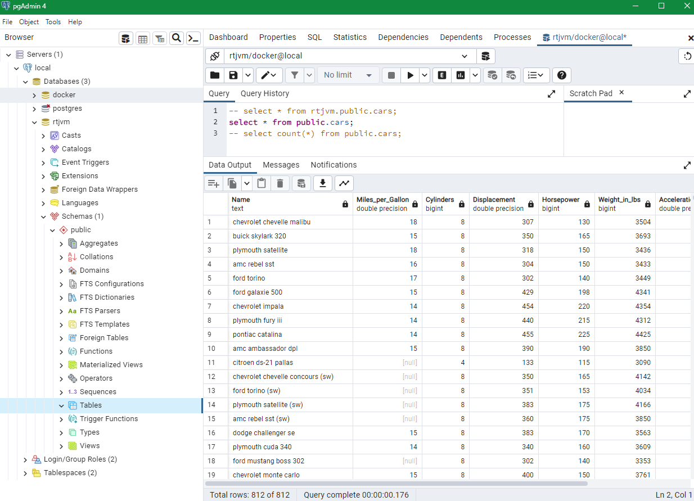

# MyPostgreSQL

My PostgreSQL

## Use PostgreSQL with Docker in Windows

### IntelliJ (My 1st choice)

It's handy to do one-stop-shoppings at a place like Costco.

Install "Database Navigator" plugin!


Note:

- Mind the "Auto-Commit" setting!

- "Database tools" plugin is not free - uninstall / disable it!

- This doc is good but didn't mention the plugin!

<https://www.jetbrains.com/help/idea/running-a-dbms-image.html#connect_to_psql>

### pgAdmin 4

<http://www.pgadmin.org>

Looks like this tool has lot of defects!



## Reference

<https://wiki.postgresql.org/wiki/PostgreSQL_Clients>

## Use PostgreSQL with Docker in Mac

...

## Basic syntax

```sql
DROP TABLE [IF EXISTS] table_name [CASCADE | RESTRICT];

CREATE TABLE [IF NOT EXISTS] table_name (
   column1 datatype(length) column_contraint,
   column2 datatype(length) column_contraint,
   column3 datatype(length) column_contraint,
   table_constraints
);
```
